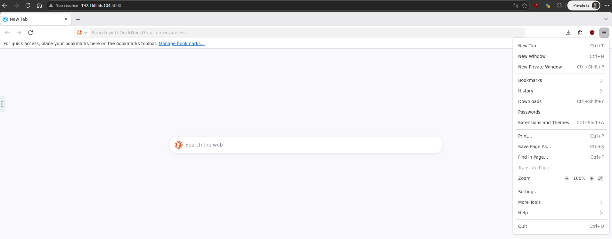
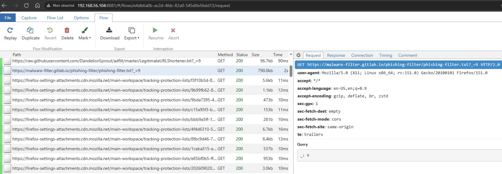

bibsnoop - Browser-in-Browser traffic snooping with mitmproxy
=============================================================

Description
-----------
Docker images for *Browser-in-Browser* with traffic observable via `mitmproxy`, allowing analysis for instance in the case of phishing / web threats analysis.  

Features
--------
* Based on the ["baseimage-gui" alpine docker image](https://github.com/jlesage/docker-baseimage-gui) of [@jlesage](https://github.com/jlesage/)
* Docker images are currently built for x64 and arm64
* LibreWolf is currently used as the browser but other browsers and cases (with/without Tor egress) are planned
* No builtin generic CA certificates: the MiTM CA used between the browser and `mitmproxy` is randomly dynamically generated at each start of the Docker image

Quickstart
-----
```
docker run --rm -it \
  -p 5800:5800 \
  -p 8081:8081 \
  ghcr.io/maaaaz/bibsnoop-librewolf:latest
```

Usage
-----
* Port **5800** is the **NoVNC WebUI of the Browser-in-Browser**


* Port **8081** is the **mitmproxy WebUI**



Copyright and license
---------------------
* All trademarks, service marks, trade names and product names appearing on this repository are the property of their respective owners 
* Content provided in this repository is distributed with the MIT licence

Inspiration and useful resources
----------------
* https://jlesage.github.io/docker-apps/ + https://github.com/jlesage?tab=repositories
* https://github.com/tbetous/mitm-chrome/
